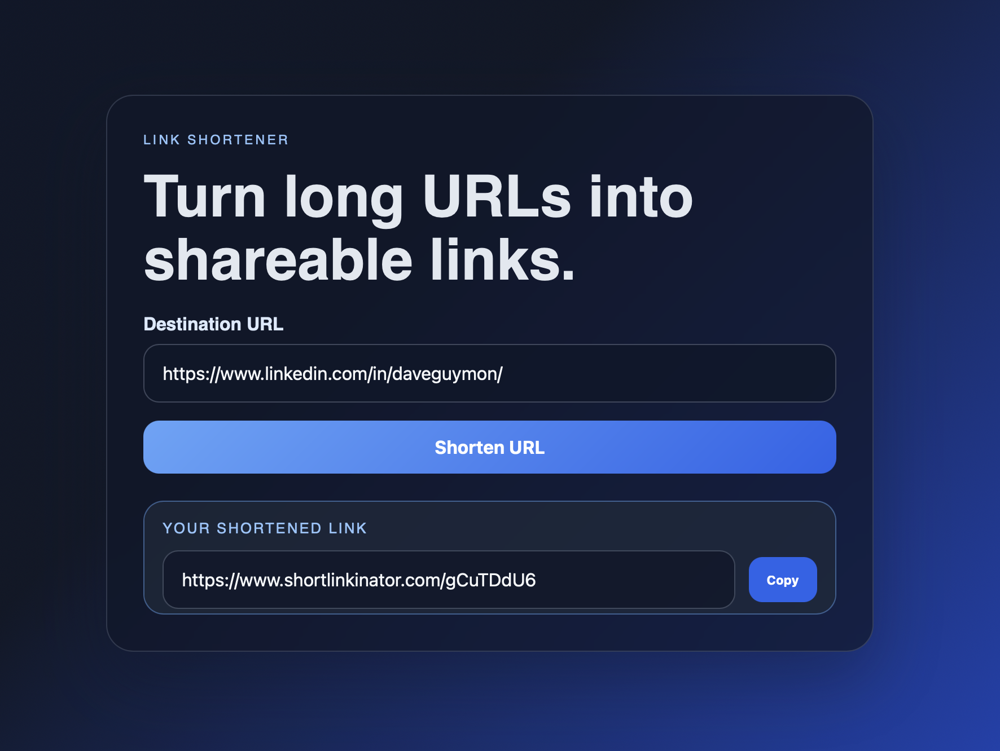

# Spec-Driven Link Shortener

A Ruby on Rails application that shortens long URLs into safe, shareable aliases and redirects users to the original destination after validation.

## Sample UI



## Features

- Create shortened links from a landing-page form
- Generate an 8-character alias for each link
- Validate incoming URLs to only allow `http` and `https` destinations
- Redirect safely only after the target has been checked
- Store link metadata including expiration date and alias
- Return the generated short URL directly in the UI for quick copy/share
- Support local development and Render deployment settings

## Tech stack

- Ruby 3.3.0
- Rails 8.0.5.1
- PostgreSQL
- Redis
- RSpec + FactoryBot
- Brakeman for security scanning
- Importmap for JavaScript

## Prerequisites

Before running the app, make sure you have:

- Ruby 3.3.0
- Bundler
- PostgreSQL running locally
- Redis running locally

## Local setup

1. Install dependencies:

   ```bash
   bundle install
   ```

2. Create and initialize the database:

   ```bash
   bin/rails db:create
   bin/rails db:migrate
   ```

3. Start Redis if it is not already running.

4. Start the Rails app:

   ```bash
   bin/rails server
   ```

5. Open the app in a browser at:

   ```text
   http://localhost:3000
   ```

## Environment configuration

The app expects the following environment values in local or deployed environments:

- `APP_BASE_URL` for the generated short-link host
- `DATABASE_URL` for PostgreSQL connection details when running in production-like environments
- `REDIS_URL` for Redis connection details

Example local values:

```bash
export APP_BASE_URL="http://localhost:3000"
export DATABASE_URL="postgresql://localhost/spec_driven_link_shortener_development"
export REDIS_URL="redis://localhost:6379/0"
```

## How it works

- A user submits a URL from the main page.
- The app validates that the URL is a valid `http` or `https` URL.
- A unique alias is generated and stored in PostgreSQL.
- The app returns the full short URL to the UI.
- When the alias is visited, the app verifies the target and redirects safely.

## Testing

Run the test suite with:

```bash
bundle exec rspec
```

You can also run the targeted specs for the link logic:

```bash
bundle exec rspec spec/models/short_link_spec.rb spec/requests/short_links_spec.rb
```

## Security checks

Run the static Rails security scan:

```bash
bin/brakeman --no-pager
```

Check JavaScript dependency security:

```bash
bin/importmap audit
```

## Deployment

This project is intended to deploy on Render.

Render deployment should include:

- PostgreSQL service or database connection via `DATABASE_URL`
- Redis service or connection via `REDIS_URL`
- `APP_BASE_URL` set to the public Render URL for the app

The application is configured to generate short URLs using `APP_BASE_URL` so the public URL is correct in both local and deployed environments.

## Project notes

The redirect safety check deliberately allows only safe external destinations and rejects invalid or unsupported URL targets. This prevents unsafe open redirects while still supporting valid user-submitted URLs.
